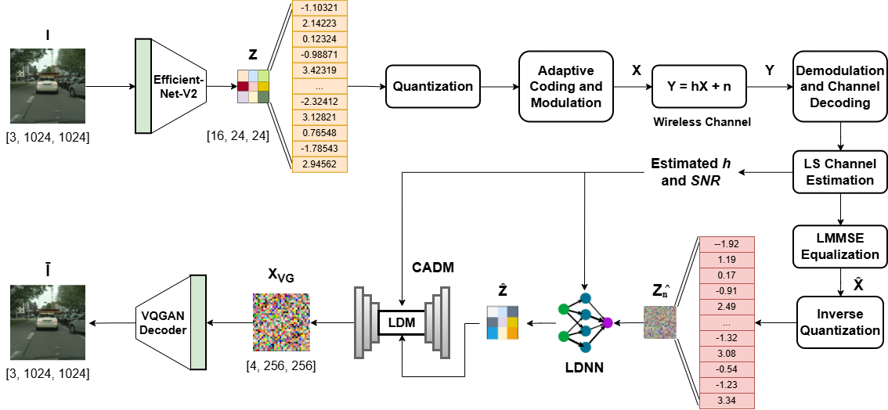

# D-SIC: Energy-Efficient Digital Semantic Image Communication via Large Generative Models

This repository contains the code for the paper titled "D-SIC: Energy-Efficient Digital Semantic Image Communication via Large Generative Models". Much of the code in this repository is based on Stable Cascade (https://github.com/Stability-AI/StableCascade).  

## 🌟 Overview
This paper introduces a digital semantic image communication (SIC) framework that incorporates Stable Cascade (SC) to achieve the goal of reliable, efficient and digitally compatible SIC. The architecture of SC is extensively modified to mitigate channel-induced distortions using Channel State Information (CSI) and corrupted image embeddings as conditioning.



## 💻 Installation
* **Step 1: Clone the directory**
  
  Download the code to your local machine and navigate into the project directory.
  ```bash
  git clone https://github.com/abilalk02/D-SIC.git
  
* **Step 2: Set up the Conda environment**

  Create the environment using the provided environment.yml file
  ```bash
  # Create the environment from the provided configuration file
  conda env create -f environment.yml

  # Activate the environment
  conda activate DSIC
  
* **Step 3: Download pretrained model weights**

  The pretrained model weights can be downloaded from https://huggingface.co/khalidr4/DSIC. You can download manually or use the ```huggingface_hub``` Python library. You will be able to download two folders i.e. ```models``` and ```finetuned``` . The first folder contains pretrained weights of the relevant stable cascade models. The second folder contains the pretrained D-SIC model weights for the Cityscapes dataset and the Rician channel (can also be used for AWGn and Rayleigh channels, with minor performance degradation). All pretrained model weights for all channels and datasets will eventually be accessible via the HuggingFace repository.
  ```bash
  python -c "
  from huggingface_hub import snapshot_download
  snapshot_download(
      repo_id='khalidr4/DSIC', 
      local_dir='./models', 
      local_dir_use_symlinks=False
  )
  "
  
* **Step 4: Download training and test datasets**

  The Cityscapes data can be downloaded from https://huggingface.co/datasets/khalidr4/DSIC-Cityscapes_data or directly from the root https://www.cityscapes-dataset.com/. The train and test datasets should be downloaded and saved as .tar files in the 'data/train/without_captions' and 'data/test/without_captions' folders in the GitHub repository, respectively. D-SIC is trained without text caption conditioning. Thus, the .txt files are empty.
  ```bash
  python -c "
  from huggingface_hub import snapshot_download
  snapshot_download(
      repo_id='khalidr4/DSIC-Cityscapes_data', 
      repo_type='dataset', 
      local_dir='./data',
      local_dir_use_symlinks=False
  )
  "

* **Step 4: Download training and test datasets**

  The Cityscapes data can be downloaded from https://huggingface.co/datasets/khalidr4/DSIC-Cityscapes_data or directly from the root https://www.cityscapes-dataset.com/. The train and test datasets should be downloaded and saved as .tar files in the 'data/train/without_captions' and 'data/test/without_captions' folders in the GitHub repository, respectively. D-SIC is trained without text caption conditioning. Thus, the .txt files are empty.
  ```bash
  python -c "
  from huggingface_hub import snapshot_download
  snapshot_download(
      repo_id='khalidr4/DSIC-Cityscapes_data', 
      repo_type='dataset', 
      local_dir='./data',
      local_dir_use_symlinks=False
  )
  "  

## Inference

**To test the model using the pretrained checkpoint, simply run ```python sampling.py```**. Note: you may need to modify model and dataset paths in the ```/configs/inference/sampling.yaml``` file. 

## Training

**To fine-tune the model on a new dataset or different channel conditions, you need to run `python train_dsic.py`**. Note: you will need to modify the dataset path in ```configs/training/train_dsic.yaml``` file. You can also adjust training parameters from the configuration file. You may also wish to change the conditioning or train under different conditions, for which you will need to modify the provided training script.

## Evaluation

You can compute LPIPS, FID, PSNR and SSIM using the provided evaluation scripts, i.e., ```compute_lpips.py```, ```compute_fid.py``` and ```compute_psnr_ssim.py```. You may need to update paths to the appropriate directories to run the scripts successfully.

## TO-DO List

* Upload trained model weights for AWGN and Rayleigh channels on HuggingFace for Cityscapes. (Note: The pretrained model currently accessible on HuggingFace was trained on Rician channels. It can be used for AWGN and Rayleigh channels also with only a slight degradation in performance)
* Upload trained model weights for the DIV2K dataset
   
